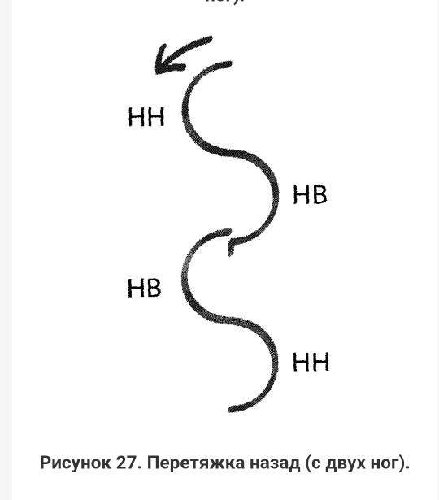

# Краткая информация 

 ## **Садчикова Елена Владимировна**

### Программы, изученные в GB:
1. Умение учится.
2. Введение в математику и информатику(для программистов)
3. Введение в математику.

### В данный момент осваиваю Введение в контроль версий. На данный момент пройдено:
* Лекция 1
* Семенар 1
* Лекция 2

На данный момент уже умею создавать ветки и вставлять картинки, но не буду этого делать, т.к. не было такого задания.

*Что-то еще нужно вставить курсивом...*

Создать несколько версий коммитов и проверить журнал изменений и посмотреть разницу между коммитами. 

Это тесты по фигурному катанию.

Попробую применить знания о вставлении ссылок из инета

[Изучение ветвления](https://learngitbranching.js.org/?locale=ru_RU)

Попробуем с изменением размера картинки

По-моему размер картинки не меняется.

Остался последний пункт создания 4 ветки. В ней хочу попробовать файл игнорирования.

 

НАДО БЫТЬ ВНИМАТЕЛЬНЕЕ С СИНТАКСИСОМ!!!